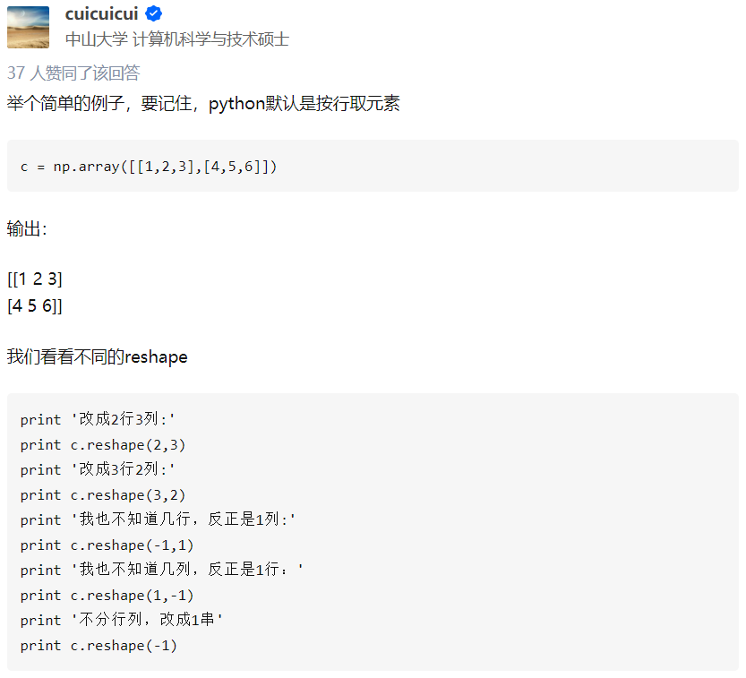
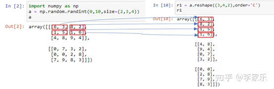
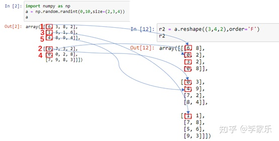

<!--Copyright © Microsoft Corporation. All rights reserved.
  适用于[License](https://github.com/Microsoft/ai-edu/blob/master/LICENSE.md)版权许可-->

## 17.5 池化层

### 17.5.1 常用池化方法

池化 pooling，又称为下采样，downstream sampling or sub-sampling。

池化方法分为两种，一种是最大值池化 Max Pooling，一种是平均值池化 Mean/Average Pooling。如图17-32所示。


图17-32 池化

- 最大值池化，是取当前池化视野中所有元素的最大值，输出到下一层特征图中。
- 平均值池化，是取当前池化视野中所有元素的平均值，输出到下一层特征图中。

其目的是：

- 扩大视野：就如同先从近处看一张图片，然后离远一些再看同一张图片，有些细节就会被忽略
- 降维：在保留图片局部特征的前提下，使得图片更小，更易于计算
- 平移不变性，轻微扰动不会影响输出：比如上图中最大值池化的4，即使向右偏一个像素，其输出值仍为4
- 维持同尺寸图片，便于后端处理：假设输入的图片不是一样大小的，就需要用池化来转换成同尺寸图片

一般我们都使用最大值池化。<font color=green> 这里就是给出了，一般情况下，就是使用这个最大值池化，另外，上面介绍的四个目的，其实也是pooling的一个很好的作用了。</font> <font color=red>, ToDo:那什么时候，是会使用这个平均值池化的呢？</font>

### 17.5.2 池化的其它方式

在上面的例子中，我们使用了size=2x2，stride=2的模式，这是常用的模式，即步长与池化尺寸相同。

我们很少使用步长值与池化尺寸不同的配置，所以只是提一下，如图17-33。


图17-33 步长为1的池化

上图是stride=1, size=2x2的情况，可以看到，右侧的结果中，有一大堆的3和4，基本分不开了，所以其池化效果并不好。<font color=blue> 基于图17.32 & 图17.33的内容，就是可以知道，在pooling layer，这个stride是和pooling的尺寸是一致的。</font> 

假设输入图片的形状是 $W_1 \times H_1 \times D_1$，其中W是图片宽度，H是图片高度，D是图片深度（多个图层），F是池化的视野（正方形），S是池化的步长，则输出图片的形状是：

$$
\begin{cases}
W_2 = (W_1 - F)/S + 1 \\\\
H_2 = (H_1 - F)/S + 1 \\\\
D_2 = D_1
\end{cases}
$$

池化层不会改变图片的深度，即D值前后相同。<font color=green> 但是在卷积层，就是会改变这个D值的了。另外，上面这个公式，其实就是和Section 17.1中的最后一个公式是非常近似的，唯一的不同，就是这里的公式没有加入padding相关的term。</font> 

### 17.5.3 池化层的训练

我们假设图17-34中，$[[1,2],[3,4]]$是上一层网络回传的残差，那么：

- 对于最大值池化，残差值会回传到当初最大值的位置上，而其它三个位置的残差都是0。<font color=green> 这个是在反向传播的过程中。</font> 
- 对于平均值池化，残差值会平均到原始的4个位置上。


图17-34 平均池化与最大池化


图17-35 池化层反向传播的示例

#### Max Pooling

严格的数学推导过程以图17-35为例进行。

正向公式：

$$
w = max(a,b,e,f)
$$

反向公式（假设Input Layer中的最大值是b）：

$$
{\partial w \over \partial a} = 0, \quad {\partial w \over \partial b} = 1
$$

$$
{\partial w \over \partial e} = 0, \quad {\partial w \over \partial f} = 0
$$

因为a,e,f对w都没有贡献，所以偏导数为0，只有b有贡献，偏导数为1。

$$
\delta_a = {\partial J \over \partial a} = {\partial J \over \partial w} {\partial w \over \partial a} = 0
$$

$$
\delta_b = {\partial J \over \partial b} = {\partial J \over \partial w} {\partial w \over \partial b} = \delta_w \cdot 1 = \delta_w
$$

$$
\delta_e = {\partial J \over \partial e} = {\partial J \over \partial w} {\partial w \over \partial e} = 0
$$

$$
\delta_f = {\partial J \over \partial f} = {\partial J \over \partial w} {\partial w \over \partial f} = 0
$$

#### Mean Pooling

正向公式：

$$w = \frac{1}{4}(a+b+e+f)$$

反向公式（假设Layer-1中的最大值是b）：

$$
{\partial w \over \partial a} = \frac{1}{4}, \quad {\partial w \over \partial b} = \frac{1}{4}
$$

$$
{\partial w \over \partial e} = \frac{1}{4}, \quad {\partial w \over \partial f} = \frac{1}{4}
$$

因为a,b,e,f对w都有贡献，所以偏导数都为1：

$$
\delta_a = {\partial J \over \partial a} = {\partial J \over \partial w} {\partial w \over \partial a} = \frac{1}{4}\delta_w
$$

$$
\delta_b = {\partial J \over \partial b} = {\partial J \over \partial w} {\partial w \over \partial b} = \frac{1}{4}\delta_w
$$

$$
\delta_e = {\partial J \over \partial e} = {\partial J \over \partial w} {\partial w \over \partial e} = \frac{1}{4}\delta_w
$$

$$
\delta_f = {\partial J \over \partial f} = {\partial J \over \partial w} {\partial w \over \partial f} = \frac{1}{4}\delta_w
$$

无论是max pooling还是mean pooling，都没有要学习的参数，所以，在卷积网络的训练中，池化层需要做的只是把误差项向后传递，不需要计算任何梯度。<font color=green> 怪不得这个pooling的反向传播是这么的简单的，也就是说，对于max pooling来说，需要做的事情就是把相应的数值给传递到特定的位置上面去，但是对于average pooling来说，反向传播就是需要除以一个系数了（这个系数就是由pooling的尺寸决定的，如图17.35）。</font> 

### 17.5.4 实现方法1

按照标准公式来实现池化的正向和反向代码。

```Python
class PoolingLayer(CLayer):
    def forward_numba(self, x, train=True):
        ......

    def backward_numba(self, delta_in, layer_idx):
        ......
```

有了前面的经验，这次我们直接把前向和反向函数用numba方式来实现，并在前面加上@nb.jit修饰符：
```Python
@nb.jit(nopython=True)
def jit_maxpool_forward(...):
    ...
    return z

@nb.jit(nopython=True)
def jit_maxpool_backward(...):
    ...
    return delta_out
```

### 17.5.5 实现方法2

池化也有类似与卷积优化的方法来计算，在图17-36中，我们假设大写字母为池子中的最大元素，并且用max_pool方式。


图17-36 池化层的img2col实现

原始数据先做img2col变换，然后做一次np.max(axis=1)的max计算，会大大增加速度，然后把结果reshape成正确的矩阵即可。做一次大矩阵的max计算，比做4次小矩阵计算要快很多。

```Python
class PoolingLayer(CLayer):
    def forward_img2col(self, x, train=True):
        ......

    def backward_col2img(self, delta_in, layer_idx):
        ......
```

<font color=red> 在方法二中，是怎么样子记住这个最大的数值的位置的呢，这个在反向传播中是非常的重要的。</font> 

### 17.5.6 性能测试

下面我们要比较一下以上两种实现方式的性能，来最终决定使用哪一种。<font color=red> 原来这两三天一直纠结的点在于这个卷积的优化上面，其实这个最基本的方法，我倒是能够理解的，就是这个更高效的方法，还是需要多看看的了。</font> 

对同样的一批64个样本，分别用两种方法做5000次的前向和反向计算，得到的结果：

```
Elapsed of numba: 17.537396907806396
Elapsed of img2col: 22.51519775390625
forward: True
backward: True
```

numba方法用了17秒，img2col方法用了22秒。并且两种方法的返回矩阵值是一样的，说明代码实现正确。

### 代码位置

ch17, Level5

<font color=red> 有点奇怪，为什么使用vector的方式，反而速度是更加的慢的了（我自己跑了一下，反而是最原始的方案一速度更快一些，这个有点奇怪了）。</font>

<font color=red> ToDo: 需要把Section 17.3 - 17.5 部分的内容需要再看一遍，主要就是这个全连接层实现反向传播的方式【参见Section 5.2 & 9.4】，卷积的反向传播机制，卷积的优化代码部分了，reshape

------------------------------------------------------------------------------------------

下面这张图片，就是给出了reshape中出现-1的情况，我的理解，就是说比如说是二维的数组，第一个元素是行，第二个元素是列，-1的作用就是我不想算这个具体的数据了，python自己去算就是了，我只是给定一下我想要的行（或者是列）的数值。简言之，这个-1的作用，就是自适应该维度大小。同时呢，这个也是可以使用在高维度上面的了。

同时，参见下面两个链接，以了解更多关于numpy的用法 https://www.jianshu.com/p/fc2fe026f002 and https://zhuanlan.zhihu.com/p/368867083






</font>